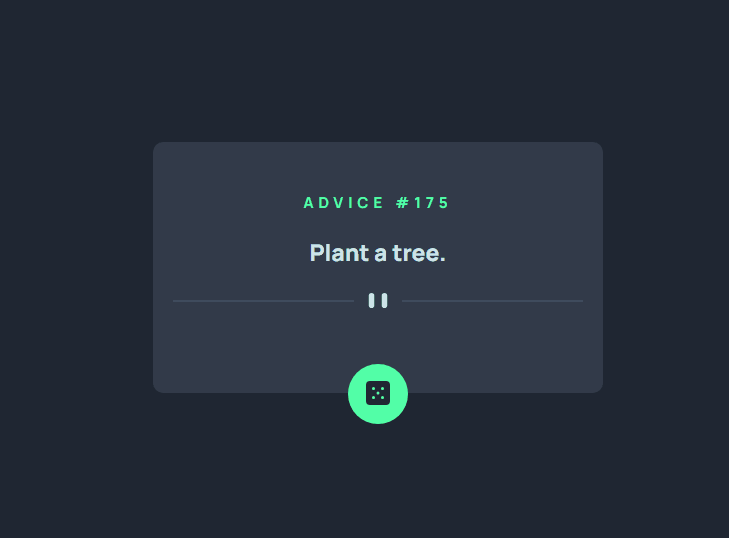

# Frontend Mentor - Solução do Aplicativo Gerador de Conselhos
Esta é uma solução para o desafio do aplicativo gerador de conselhos no Frontend Mentor.

## Índice
- [Visão Geral](#Visão-Geral)
  - [O Desafio](#O-Desafio)
  - [Captura de Tela](#Captura-de-Tela)
  - [Construsão](#Construsão)

## Visão Geral

### O Desafio

Os usuários devem ser capazes de:

- Visualizar o layout ideal para o aplicativo, dependendo do tamanho da tela do dispositivo.
- Ver estados de hover para todos os elementos interativos na página.
- Gerar um novo conselho clicando no ícone do dado.

### Captura de Tela

[]

### Construsão

- Marcação HTML5 semântica
- Propriedades CSS personalizadas
- Flexbox
- CSS Grid
- Responsividade para mobile
- Funções JavaScript
- Aplicação de API

==========================================================================================================================================================
##### English version

# Frontend Mentor - Advice generator app solution

This is a solution to the [Advice generator app challenge on Frontend Mentor](https://www.frontendmentor.io/challenges/advice-generator-app-QdUG-13db).

## Table of contents

- [Overview](#overview)
  - [The challenge](#the-challenge)
  - [Screenshot](#screenshot)
  - [Built with](#built-with)

## Overview

### The challenge

Users should be able to:

- View the optimal layout for the app depending on their device's screen size
- See hover states for all interactive elements on the page
- Generate a new piece of advice by clicking the dice icon

### Screenshot

[]

### Built with

- Semantic HTML5 markup
- CSS custom properties
- Flexbox
- CSS Grid
- Mobile-first workflow
- JavaScript functions
- API application

